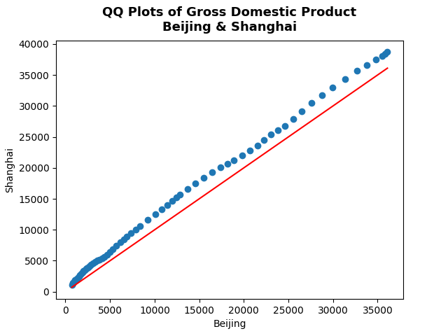

# qq-plot-gdp
This repository is to create qq plot that comparing quantiles of GDP of Beijing and Shanghai from 1992-2020. The X-axis is for quantiles of Beijing's GDP and Y-axis is for quantiles of Shanghai's GDP. The QQ Plot's result show that Shanghai's GDP is quite higher than Beijing's GDP

**1. QQ Plot Result**

 
